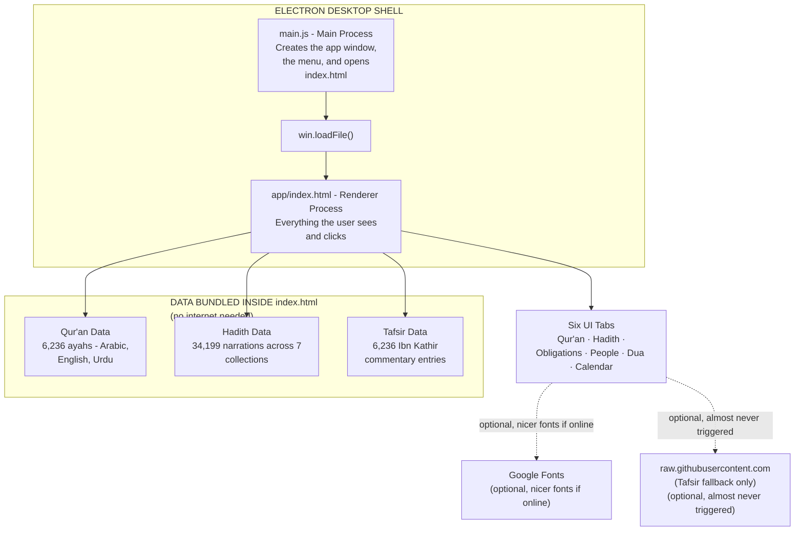
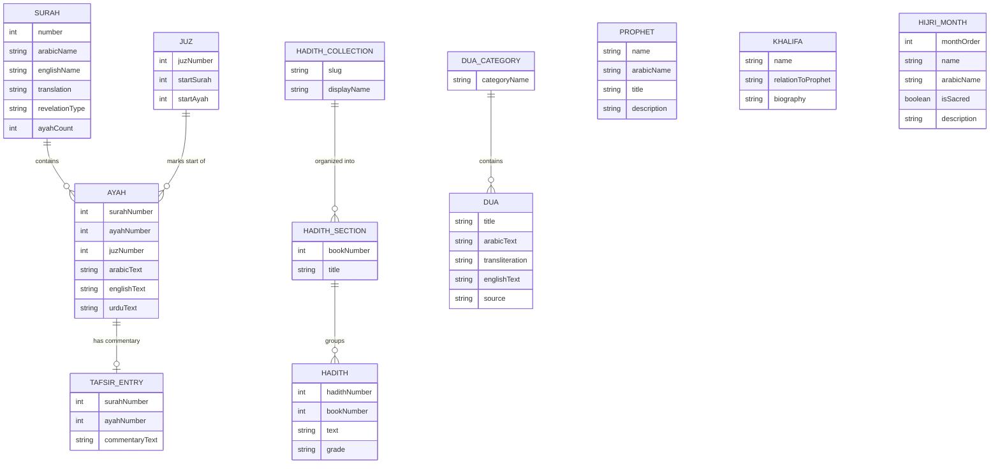
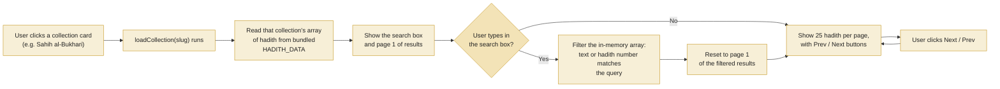

# نور - Noor: Technical Documentation

*How the app is built, how its data is organized, and how each feature works under the hood*

Prepared for Mohammed Saqib · Covers the Electron desktop build of the Noor Qur'an App

> **Diagram format:** All technical diagrams in this document are embedded as native **Mermaid** diagrams. There are no external image dependencies, so this document is self-contained as a single `.md` file.

---

## Table of Contents

1. [What This App Is](#1-what-this-app-is)
2. [System Architecture](#2-system-architecture)
3. [Data Model (Entity–Relationship Diagram)](#3-data-model-entityrelationship-diagram)
4. [Core Algorithms](#4-core-algorithms)
   - [4.1 Starting up: loading and indexing the data](#41--starting-up-loading-and-indexing-the-data)
   - [4.2 Rendering a Surah and reacting to taps](#42--rendering-a-surah-and-reacting-to-taps)
   - [4.3 Searching and paging through Hadith](#43--searching-and-paging-through-hadith)
   - [4.4 Converting today's date to the Hijri calendar](#44--converting-todays-date-to-the-hijri-calendar)
5. [Section-by-Section Walkthrough](#5-section-by-section-walkthrough)
6. [Project File Structure](#6-project-file-structure)
7. [Offline Behavior](#7-offline-behavior--what-needs-the-internet-and-what-doesnt)
8. [Glossary](#8-glossary)

---

## 1. What This App Is

Noor is a personal, offline-first Islamic reference app covering the complete Qur'an, six major Hadith collections, the core obligations of a Muslim, key people in Islamic history, a curated set of duas, and an Islamic (Hijri) calendar - all packaged as a desktop application built with Electron.

The defining design decision behind this app is that almost everything is bundled directly inside the app itself, rather than fetched from the internet each time you open it. Early versions relied on live API calls for the Qur'an and Hadith text, which broke in restricted network environments. Every major data source is now embedded, so the app works the same whether you're online or completely offline.

### Quick Facts

| Metric | Value |
|---|---|
| Qur'an coverage | 114 Surahs · 6,236 Ayahs · Arabic + English + Urdu |
| Hadith coverage | 34,199 narrations across 7 collections (6 canonical + 40 Hadith Nawawi) |
| Tafsir coverage | 6,236 Ibn Kathir commentary entries (one per ayah) |
| Languages shown | Arabic (Uthmani script), English (Saheeh International), Urdu (Fateh Muhammad Jalandhry) |
| Runs as | A standalone Electron desktop app (Windows / macOS / Linux) |
| Internet required for | Nicer web fonts only - everything else works fully offline |
| Core technology | HTML, CSS, vanilla JavaScript, wrapped in Electron |

---

## 2. System Architecture

The app has two processes, which is standard for any Electron app:

- **The Main Process** (`main.js`) - a small Node.js script that creates the desktop window, builds the menu bar, and tells the window what file to open.
- **The Renderer Process** (`app/index.html`) - a single, self-contained HTML file that is the entire application: layout, styling, logic, and data.

Everything you interact with - the Qur'an reader, the Hadith browser, the Dua cards - lives inside that one HTML file. Instead of that file reaching out to the internet for its content, the Qur'an text, every hadith, and every tafsir entry are embedded directly inside it as JSON data, right alongside the code that displays them.

### Figure 1 - System architecture



*Figure 1 - How the pieces fit together: Electron loads one HTML file, which already contains all its data.*

### Why bundle the data instead of fetching it live?

The first version of this app fetched the Qur'an and Hadith text from external APIs every time a Surah or a Hadith collection was opened. That worked on an open network, but failed in more restricted environments - corporate networks, sandboxed previews, or offline use - because the fetch requests were blocked before they reached the data source.

The fix was to download the full Qur'an, all Hadith collections, and the full Tafsir commentary once, trim them to what the app actually needs, and embed them directly inside `index.html` as JSON. The app now has zero dependency on the internet for its core content - it reads its own bundled data instead of asking a server for it.

---

## 3. Data Model (Entity–Relationship Diagram)

Although the app doesn't use a database - everything lives in JSON - it's still useful to think of the content as a set of related entities, the way you would in a database design. This is what that structure looks like.

### Figure 2 - Entity–relationship diagram



*Figure 2 - Entity–relationship diagram of the app's content. `PROPHET`, `KHALIFA`, and `HIJRI_MONTH` are standalone reference entities in the application.*

### What each entity means

| Entity | What it holds | Where it's used |
|---|---|---|
| **SURAH** | One of the 114 chapters - its Arabic name, English meaning, whether it's Meccan or Medinan, and how many ayahs it has. | Qur'an tab header |
| **AYAH** | One verse - its Arabic text, English translation, Urdu translation, which Surah and Juz it belongs to. | Qur'an tab, main reading list |
| **JUZ** | One of the 30 equal parts (Sipara) the Qur'an is traditionally divided into, for structured daily reading. | Juz jump menu + in-page markers |
| **TAFSIR ENTRY** | Ibn Kathir's classical commentary for one specific ayah - its meaning and, where known, why it was revealed. | "Meaning & Context" panel |
| **HADITH COLLECTION** | One of the seven hadith books (e.g. Sahih al-Bukhari). | Hadith tab, collection picker |
| **HADITH SECTION** | A book/chapter subdivision inside a collection (e.g. "Revelation", "Belief"). | Shown as a label on each hadith card |
| **HADITH** | One narration - its number, text, and authenticity grade where available. | Hadith tab, results list |
| **DUA CATEGORY** | A grouping like "Anxiety & Distress" or "Gratitude". | Dua tab, filter buttons |
| **DUA** | One supplication - Arabic, transliteration, English meaning, and its source. | Dua tab, cards |
| **PROPHET / KHALIFA** | Biographical entries for the 25 Qur'anic prophets and the four Rightly-Guided Caliphs. | People tab |
| **HIJRI MONTH** | The 12 lunar months, which are sacred, and their significance. | Calendar tab |

---

## 4. Core Algorithms

This section walks through the actual logic the app runs - written as pseudocode so it reads clearly regardless of your JavaScript familiarity, alongside the real function names from the code.

### 4.1 - Starting up: loading and indexing the data

The very first thing that happens when the app opens is `bootData()`. It reads the three JSON blocks embedded in the page and builds two lookup structures in memory so the rest of the app never has to search through all 6,236 ayahs one at a time.

```text
FUNCTION bootData():
    QURAN_DATA  ← JSON.parse(quranDataJson block)
    HADITH_DATA ← JSON.parse(hadithDataJson block)
    TAFSIR_DATA ← JSON.parse(tafsirDataJson block)

    ayahsBySurah   ← empty Map            // surah number → list of its ayahs
    JUZ_START_LIST ← empty list           // the 30 Juz boundaries
    previousJuz    ← null

    FOR each ayah IN QURAN_DATA.ayahs:     // already in correct mushaf order
        (surah, ayahNum, juz, arabic, english, urdu) ← ayah
        ADD ayah TO ayahsBySurah[surah]

        IF juz ≠ previousJuz:               // we've crossed into a new Juz
            APPEND {juz, surah, ayahNum} TO JUZ_START_LIST
            previousJuz ← juz

    RETURN true
```

Because the 6,236 ayahs are already stored in the correct reading order (Surah 1 Ayah 1, Surah 1 Ayah 2, … Surah 114 Ayah 6), a single pass through the list is enough to both group ayahs by Surah and detect every Juz boundary - there's no need for a separate calculation or a hand-written table of Juz boundaries anywhere in the app.

### 4.2 - Rendering a Surah and reacting to taps

### Figure 3 - Ayah rendering and Tafsir flow

```mermaid
flowchart LR
    A["User selects a Surah<br/>from dropdown"] --> B["loadSurah(number) runs"]
    B --> C["Look up that Surah's ayahs<br/>in the ayahsBySurah map<br/>(pre-grouped when the app booted)"]
    C --> D["Render the Surah header:<br/>Arabic name, meaning,<br/>Meccan/Medinan, ayah count"]
    D --> E["Loop through every ayah<br/>in this Surah, in order"]

    E --> F{"Does a new Juz<br/>begin at this ayah?"}
    F -->|Yes| G["Insert a gold<br/>'Juz N begins here' banner"]
    F -->|No| H["Render the ayah block<br/>(Arabic text + number circle)"]
    G --> H

    H --> I["User taps the ayah's<br/>number circle"]
    I --> J["toggleAyah() highlights<br/>the block in gold"]
    J --> K["Translation panel expands:<br/>English + Urdu"]
    K --> L{"User taps<br/>'Meaning & Context'"}

    L -->|Yes| M["loadTafsir(surah, ayah)"]
    L -->|No| N["Continue reading"]
    M --> O{"Entry exists in<br/>bundled TAFSIR_DATA?"}
    O -->|Yes - almost always| P["Show Ibn Kathir commentary<br/>instantly, no network needed"]
    O -->|No - rare| Q["Try a live fetch<br/>as a fallback"]
    Q --> R["Show result, or a plain<br/>'not available offline' note"]

    classDef process fill:#f7efd7,stroke:#c79a28,color:#222;
    classDef decision fill:#f3e3b7,stroke:#c79a28,color:#222;
    class A,B,C,D,E,G,H,I,J,K,M,N,P,Q,R process;
    class F,L,O decision;
```



*Figure 3 - What happens from picking a Surah to reading its Tafsir.*

```text
FUNCTION loadSurah(surahNumber, jumpToAyah = null):
    meta  ← QURAN_DATA.surahs[surahNumber]
    ayahs ← ayahsBySurah[surahNumber]        // O(1) lookup, no searching

    RENDER surah header (name, meaning, Meccan/Medinan, ayah count)
    IF surahNumber ≠ 9: RENDER Bismillah      // Surah 9 traditionally omits it

    FOR each ayah IN ayahs, in order:
        IF this ayah starts a new Juz (check JUZ_START_LIST):
            RENDER gold "Juz N begins here" banner
        RENDER ayah block (Arabic text + numbered circle)

    IF jumpToAyah given: SCROLL smoothly to that ayah
```

```text
FUNCTION loadTafsir(surah, ayah):
    IF already cached in this session: DISPLAY cached HTML, RETURN

    bundled ← TAFSIR_DATA[surah][ayah]
    IF bundled EXISTS:                          // true for all 6,236 ayahs
        DISPLAY bundled commentary              // instant, no network call
        RETURN

    TRY:                                         // fallback path, effectively never used
        result ← fetch(TAFSIR_API + surah + "/" + ayah)
        DISPLAY result.text
    CATCH:
        DISPLAY "not available offline" message
```

### 4.3 - Searching and paging through Hadith

### Figure 4 - Hadith search and pagination flow



*Figure 4 - How a Hadith collection is filtered and paged.*

```text
FUNCTION renderHadithList():
    query ← searchBox.value, lowercased
    all   ← HADITH_DATA[currentCollection].hadiths     // one flat array

    IF query is empty:
        filtered ← all
    ELSE:
        filtered ← all WHERE text CONTAINS query
                        OR hadithNumber CONTAINS query

    totalPages ← ceil(filtered.length / 25)
    pageItems  ← filtered[currentPage*25 .. currentPage*25+25]
    RENDER pageItems as cards (number, book title, text, grade)
```

The search box doesn't query a server or a database - it filters the collection's array that's already sitting in memory. That's fast enough to feel instant even for Sahih al-Bukhari's 7,580 narrations, because the filtering only happens on the one collection currently open, not all seven at once.

### 4.4 - Converting today's date to the Hijri calendar

```text
FUNCTION getHijri(date):
    TRY:
        RETURN Intl.DateTimeFormat("islamic-umalqura").format(date)
    CATCH:
        TRY:
            RETURN Intl.DateTimeFormat("islamic").format(date)   // generic fallback
        CATCH:
            RETURN null   // browser/Electron build lacks Islamic calendar data
```

This uses the calendar conversion tables already built into Chromium (the engine Electron runs on) - the app doesn't ship its own date-math or call any date-conversion API. That's also why the app notes that calculated Hijri dates can differ by a day from local moon-sighting announcements: it's an astronomical/tabular calculation, not a moon-sighting report.

---

## 5. Section-by-Section Walkthrough

**Qur'an**

Full 114 Surahs with adjustable Arabic text size. Tapping an ayah's number circle expands English and Urdu translations inline and highlights that ayah; tapping "Meaning & Context" reveals Ibn Kathir's commentary. A Juz/Sipara jump menu takes you straight to any of the 30 sections, with a marker shown exactly where each one begins.

**Hadith**

Seven collections - the six canonical books (Sahih al-Bukhari, Sahih Muslim, Sunan Abu Dawud, Jami' at-Tirmidhi, Sunan an-Nasa'i, Sunan Ibn Majah) plus 40 Hadith Nawawi. Each is searchable by keyword or hadith number, paginated 25 at a time, and shows the authenticity grade where the source data includes one.

**Obligations**

A static, hand-written reference (not pulled from any external source) covering the six articles of belief, the Five Pillars, and everyday conduct - each as an expandable card explaining why it matters and how it's practiced.

**People**

The 25 prophets named in the Qur'an, a family-tree view from Ibrahim through to Muhammad ﷺ and his children, the four Rightly-Guided Caliphs with their exact relation to the Prophet ﷺ, Ahl al-Bayt, and the ten companions given the glad tidings of Paradise.

**Dua**

Sixteen authentic duas grouped into categories such as anxiety, illness, fear, guidance, and gratitude - each with Arabic, transliteration, English meaning, and its hadith or Qur'an source.

**Calendar**

Today's Hijri date, a Gregorian-to-Hijri converter for any date you pick, and all 12 Hijri months with their names and religious significance, including which four are sacred months.

---

## 6. Project File Structure

| File / Folder | Purpose |
|---|---|
| `main.js` | Electron's entry point. Creates the desktop window, sets up the menu, and loads `app/index.html` into it. |
| `package.json` | App name, version, and the electron-builder configuration used to produce a Windows installer / portable exe, a macOS `.dmg`, or a Linux AppImage. |
| `build/icon.png` | The app's icon, used for the window, taskbar, and installer. |
| `app/index.html` | The entire application: all CSS, all UI logic, and three embedded JSON blocks (Qur'an, Hadith, Tafsir) that make it work offline. |
| `README.md` | Build and run instructions (`npm install`, `npm start`, `npm run dist`). |

Inside `app/index.html` specifically, there are three `<script type="application/json">` blocks holding the bundled data, and one regular `<script>` block holding all the application logic described in Section 4. Keeping the data as `application/json` (rather than executable JavaScript) means the browser just parses it as text - it's never executed, only read.

---

## 7. Offline Behavior - What Needs the Internet, and What Doesn't

| Feature | Needs internet? |
|---|---|
| Reading the Qur'an (Arabic, English, Urdu) | No - fully bundled |
| Ayah translations on tap | No - fully bundled |
| Tafsir / "Meaning & Context" | No - fully bundled (live fetch only as an unused safety net) |
| All 7 Hadith collections + search | No - fully bundled |
| Obligations, People, Dua tabs | No - static content |
| Hijri calendar + date converter | No - uses Electron's built-in calendar engine |
| Arabic/Urdu web fonts (Amiri, Noto Nastaliq) | Optional - falls back to system fonts if offline |

In short: this app was rebuilt specifically so that a blocked or unreliable internet connection never breaks its core purpose - reading and understanding the Qur'an and Hadith. The only thing that genuinely benefits from being online is slightly nicer-looking Arabic and Urdu typography.

---

## 8. Glossary

| Term | Meaning |
|---|---|
| **Ayah** | A single verse of the Qur'an. |
| **Surah** | A chapter of the Qur'an (114 total). |
| **Juz / Para / Sipara** | One of 30 roughly equal parts the Qur'an is divided into for structured reading, e.g. over a month. |
| **Tafsir** | Scholarly commentary explaining the meaning of the Qur'an, verse by verse. |
| **Ibn Kathir** | A 14th-century scholar whose Tafsir is one of the most widely referenced classical commentaries. |
| **Asbab al-Nuzul** | The recorded occasion or circumstance that prompted a particular ayah's revelation, where known. |
| **Hadith** | A recorded report of something the Prophet Muhammad ﷺ said, did, or approved of. |
| **Isnad / Grade** | The chain of narrators behind a hadith, used by scholars to grade it - commonly Sahih (authentic), Hasan (good), or Da'if (weak). |
| **Kutub al-Sittah** | "The Six Books" - the six hadith collections regarded as most authentic across the Muslim world. |
| **Hijri calendar** | The Islamic lunar calendar, dated from the Prophet's migration (Hijrah) to Madinah in 622 CE. |
| **Electron** | A framework that lets a web app (HTML/CSS/JS) run as a native desktop application with its own window and icon. |
| **Main process / Renderer process** | In Electron, the Main process manages the app and its windows; the Renderer process is the webpage running inside each window. |
| **JSON** | A plain-text data format (JavaScript Object Notation) used here to store the Qur'an, Hadith, and Tafsir inside the app file itself. |

---

*All four original diagram images have been converted into Mermaid diagrams and embedded directly in this document. The resulting file is self-contained and does not reference the original PNG files.*

